# LeakLedger

**Water Reconciliation & Repair-Verification Control Plane**

> LeakLedger turns existing water meters into an auditable water ledger that shows where water becomes unaccounted for and verifies whether maintenance actually stopped the loss.

LeakLedger is a deterministic environmental-infrastructure system built for the WeMakeDevs AWS Environmental Hackathon. It is intentionally not a generic consumption dashboard or a black-box leak detector. Its core mechanism is **physical water reconciliation across a meter topology**, explicit evidence-quality gates, trustworthy localisation boundaries, an auditable incident state machine, and post-repair verification.

## Product thesis

A conventional dashboard tells a facility team that water consumption increased. LeakLedger asks a harder operational question:

**Can every litre that entered the site be accounted for?**

For a node and reconciliation interval:

```text
Unexplained residual = measured inflow
                     - measured downstream flow
                     - known unmetered use
                     - change in storage
```

A positive residual is **not** automatically called a leak. LeakLedger first validates meter coverage, reading completeness, freshness, time alignment, counter continuity, topology consistency, and storage assumptions. If the evidence is incomplete, the system fails closed with `INSUFFICIENT_DATA`, `DATA_QUALITY_FAILURE`, or `EVIDENCE_INSUFFICIENT` instead of making an unsupported leak claim.

## Signature workflow

```text
Meter reading event
   -> normalize units and timestamps
   -> immutable raw archive
   -> reconcile parent/child water balance
   -> validate evidence quality
   -> require persistent anomalous intervals
   -> localise to deepest trustworthy branch
   -> open incident
   -> maintenance records repair
   -> VERIFYING
   -> require N distinct healthy intervals
   -> RESOLVED or REPAIR_FAILED
```

The product never closes an incident merely because a human clicked **Repair complete**.

## First-glance differentiators

LeakLedger is designed around three screens rather than a KPI-wall dashboard:

1. **Water Ledger** — every interval is presented like a physical accounting entry.
2. **Meter Topology** — localisation descends only while the evidence remains defensible.
3. **Incident Evidence** — exact arithmetic, coverage, completeness, time alignment, repair state, and audit events are visible together.

The core UX uses language such as:

```text
82.4 m³ entered
72.1 m³ measured downstream
2.0 m³ known unmetered
8.3 m³ unexplained
Deepest trustworthy anomaly: Hostel B
```

rather than only “Today's usage: 82.4 m³”.

## Demo identities

There is intentionally **no authentication or authorization** in this hackathon build. `/signin` is a demo persona selector only:

- **Aarav Mehta** — Facility Manager
- **Neha Sharma** — Maintenance Engineer
- **Rohan Kapoor** — Operations Manager

The selected persona is stored client-side and used as the actor for audit actions. All personas can access the same features and data. The sign-in screen explicitly labels this as a simulated demo environment.

## Product screenshots

Captured from the deployed demo at `https://8k133q1yyd.execute-api.ap-south-1.amazonaws.com` while running the **Hidden Hostel B loss** scenario, so every screen shows live reconciled data and an open incident (deepest trustworthy boundary `HOSTEL-B-MAIN`, 0.35 m³ unexplained, evidence `HIGH`). The three identities share the same data and features; the selected persona is stored client-side and recorded as the actor on operational actions.

### Public pages

These screens are identity-independent.

#### Landing page (`/`)

Product overview: the reconciliation thesis, a worked water balance, the fail-closed principle, repair verification, the AWS event flow, and the demo entry point.

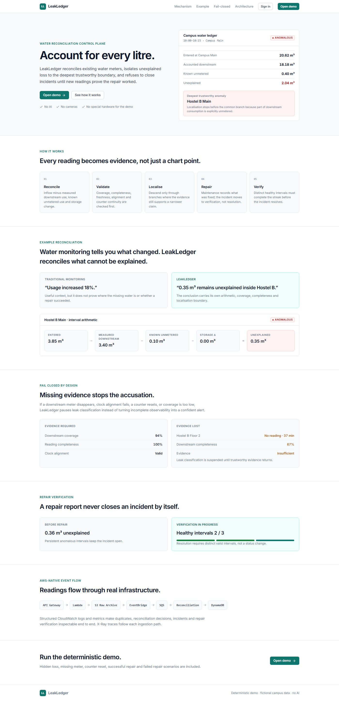

#### Sign in (`/signin`)

Demo persona selector. No password, token or Cognito flow: choosing an identity stores it client-side and enters the application.

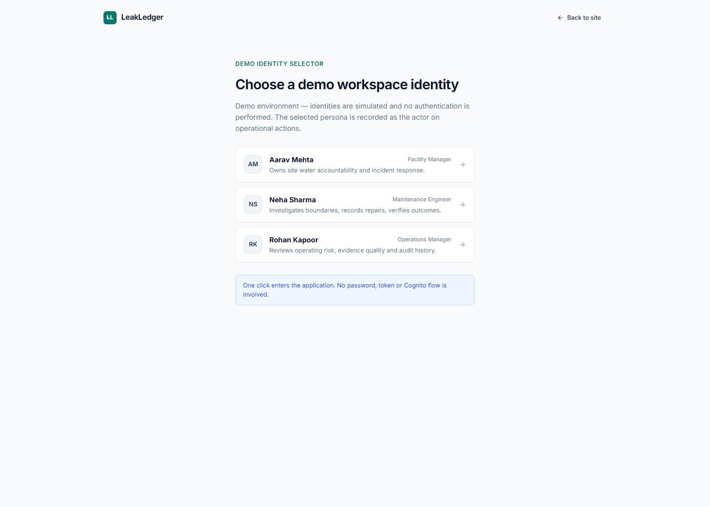

### Aarav Mehta — Facility Manager

*Owns site water accountability and incident response.*

<details open>
<summary><strong>Show the 9 application screens as Aarav Mehta</strong></summary>

#### Overview (`/overview`)

Site-wide water accountability for the latest interval: entered, measured downstream, known unmetered, storage change and unexplained residual, plus evidence quality, the highest-priority open incident, current topology state and recent reconciliation activity.


#### Water Ledger (`/ledger`)

Accounting entries for every reconciled interval with per-node filtering and state tabs. Expanding a row shows the exact arithmetic and evidence gates behind the residual.


#### Topology (`/topology`)

The water accounting hierarchy. When an incident is open the localisation path is highlighted and other branches are de-emphasised; selecting a node shows its balance, evidence and accounting configuration.

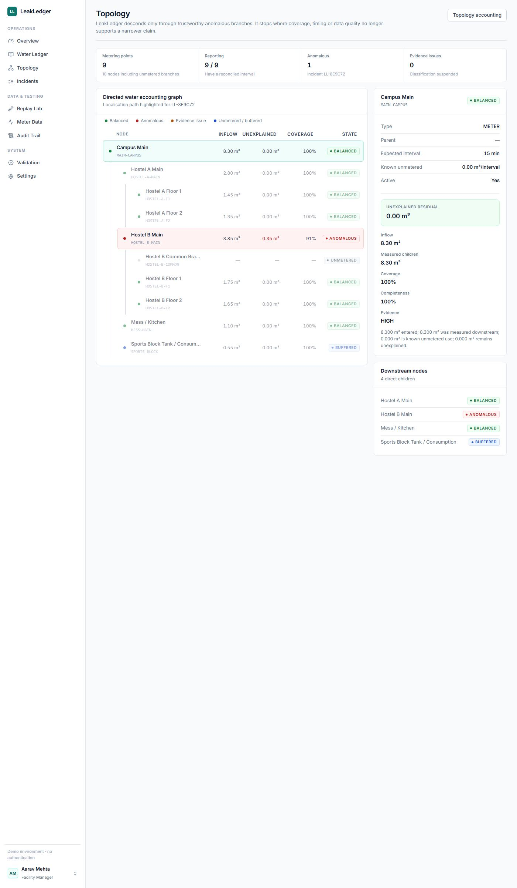

#### Incidents (`/incidents`)

Incident workspace: a filterable case list next to a detail view covering why the incident exists, evidence quality, the deepest trustworthy boundary, repair verification progress, the lifecycle timeline and guarded lifecycle actions.

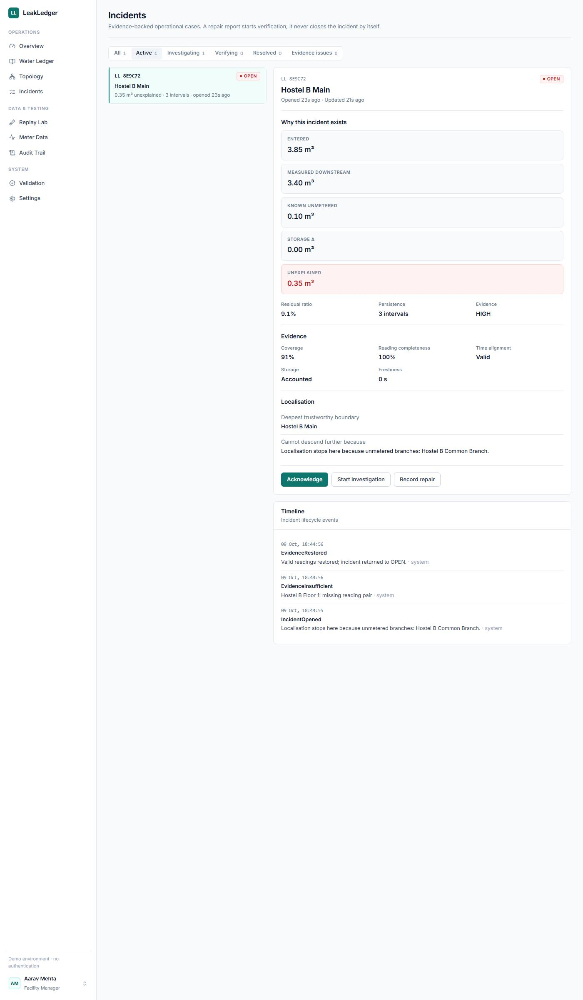

#### Replay Lab (`/replay`)

Deterministic scenario console: choose a scenario, reset, run or step it, set playback speed, and watch the live reconciliation alongside the lifecycle event stream.


#### Meter Data (`/meters`)

Meter inventory with health, freshness, latest cumulative readings and expected intervals, plus CSV import with per-row rejection reasons and the accepted CSV contract.

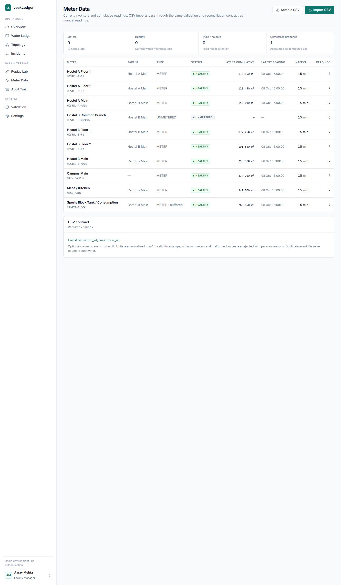

#### Audit Trail (`/audit`)

Chronological evidence log with search and event-type filters. Rows expand to show the correlation ID, extracted fields and the raw payload.

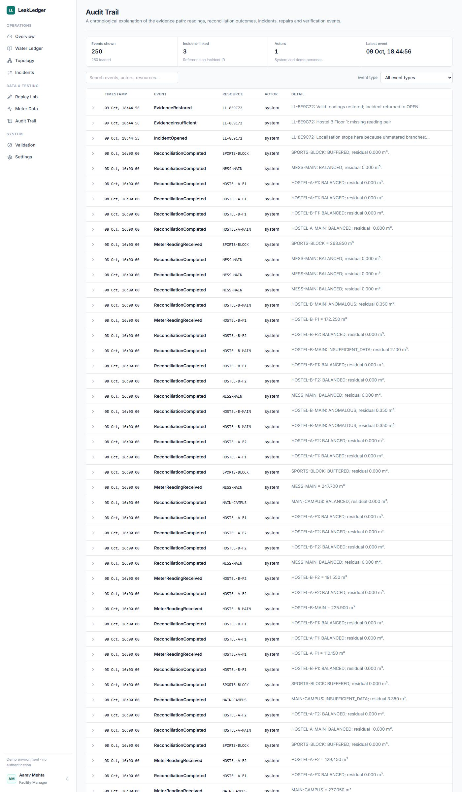

#### Settings (`/settings`)

Operational policy: anomaly rules, evidence gates, repair-verification requirements, site posture, and topology accounting for known-unmetered and buffered boundaries.


#### Validation (`/validation`)

Controlled deterministic validation report: every failure mode with its expected behaviour, PASS/FAIL result and observed detail.

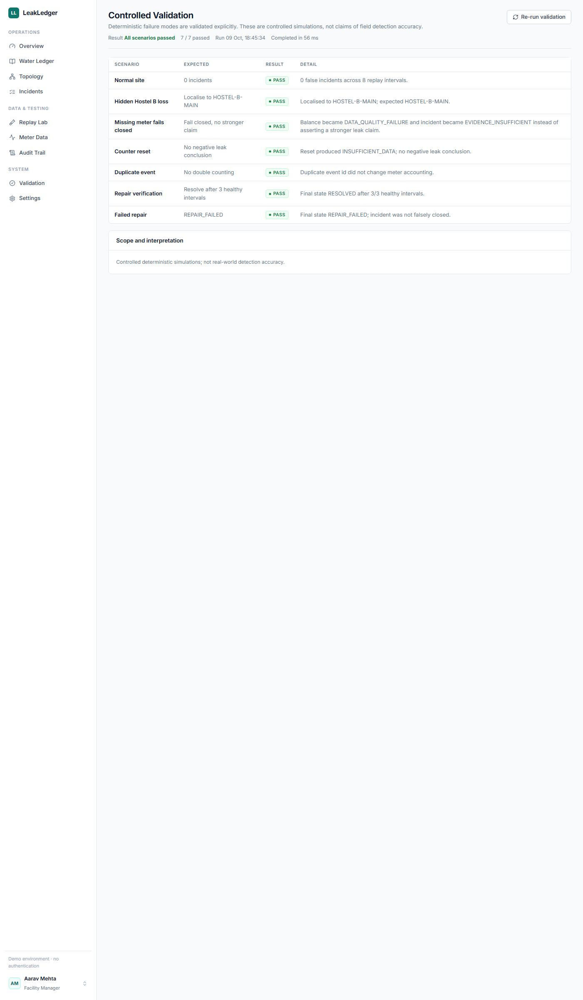

</details>

### Neha Sharma — Maintenance Engineer

*Investigates boundaries, records repairs and verifies outcomes.*

<details>
<summary><strong>Show the 9 application screens as Neha Sharma</strong></summary>

Same screens as above, captured with this identity selected.

#### Overview (`/overview`)

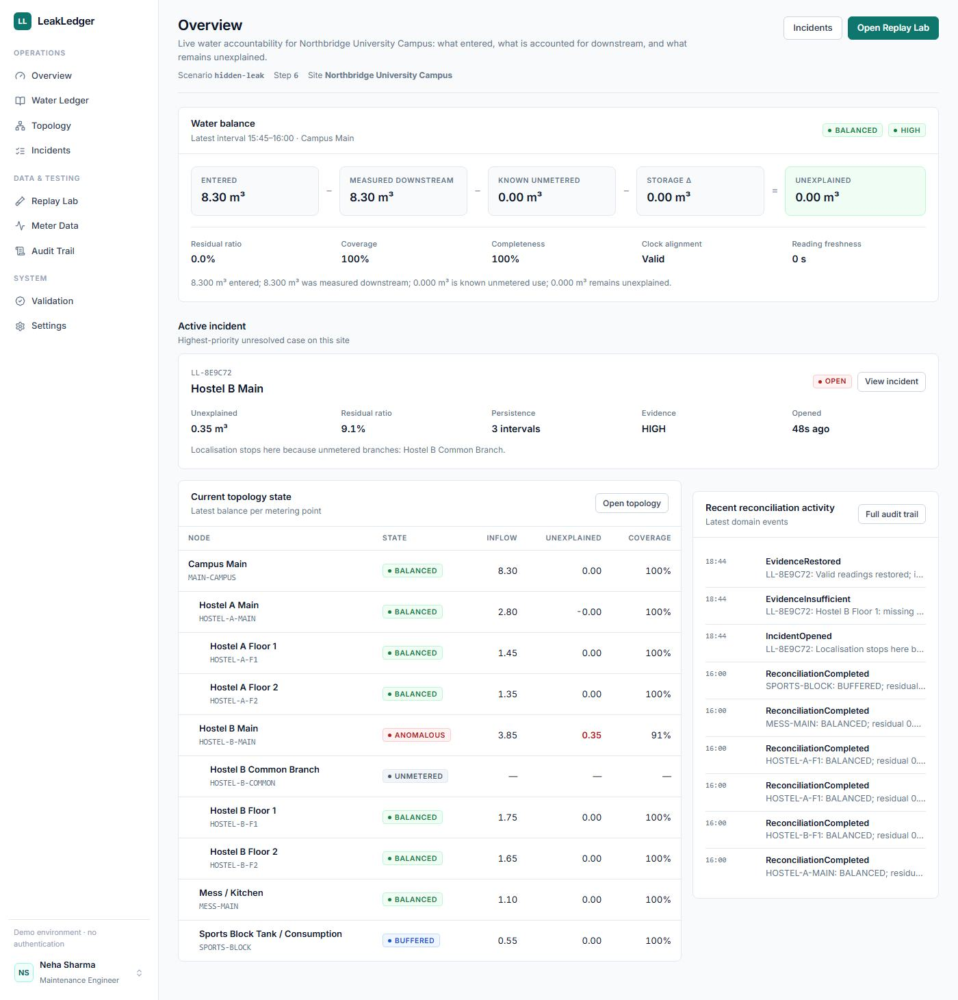

#### Water Ledger (`/ledger`)

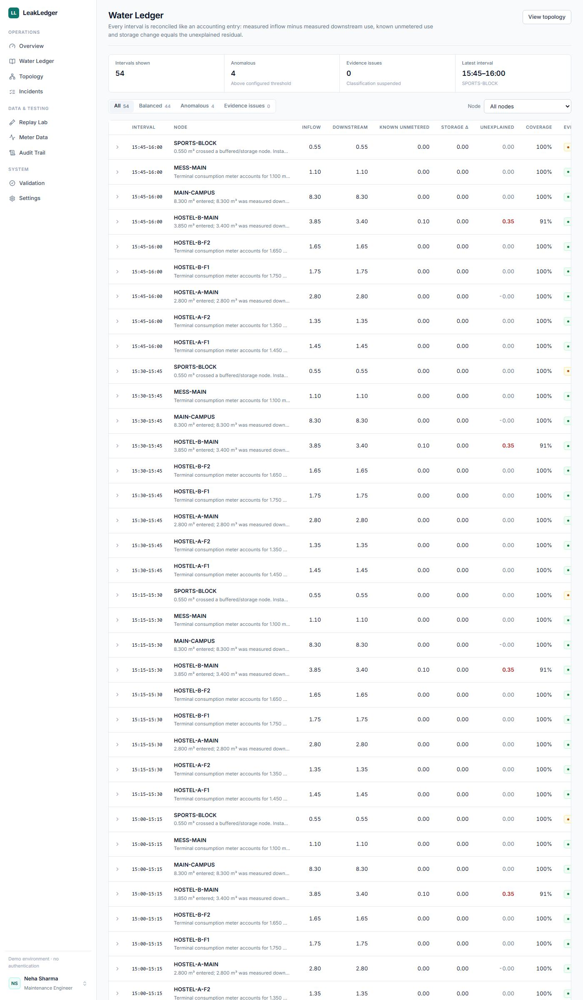

#### Topology (`/topology`)


#### Incidents (`/incidents`)


#### Replay Lab (`/replay`)

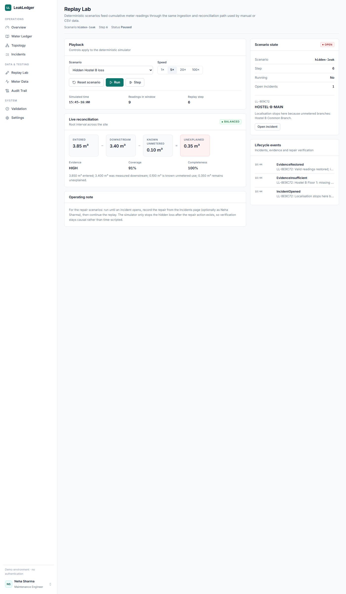

#### Meter Data (`/meters`)


#### Audit Trail (`/audit`)

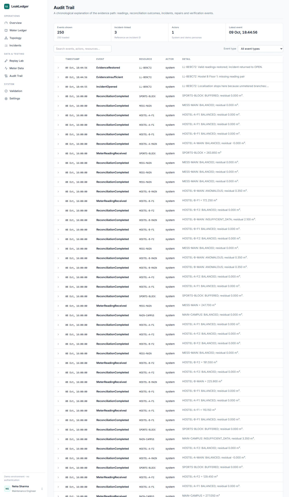

#### Settings (`/settings`)

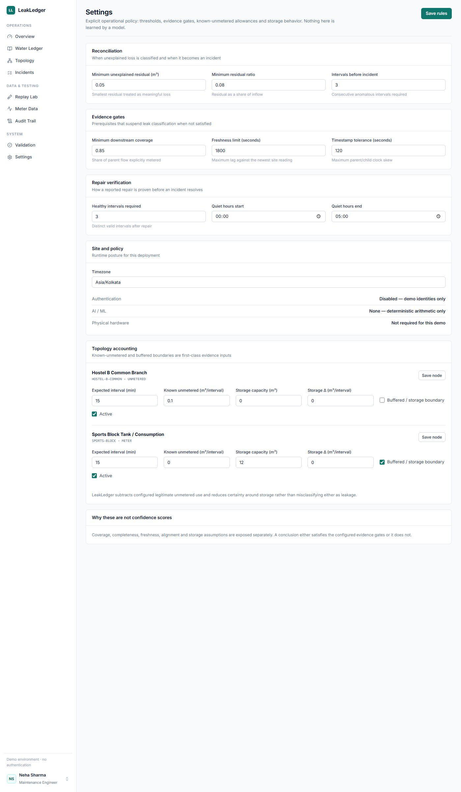

#### Validation (`/validation`)


</details>

### Rohan Kapoor — Operations Manager

*Reviews operating risk, evidence quality and audit history.*

<details>
<summary><strong>Show the 9 application screens as Rohan Kapoor</strong></summary>

Same screens as above, captured with this identity selected.

#### Overview (`/overview`)


#### Water Ledger (`/ledger`)


#### Topology (`/topology`)

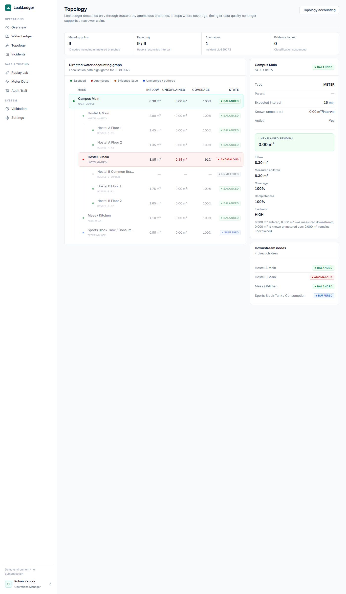

#### Incidents (`/incidents`)

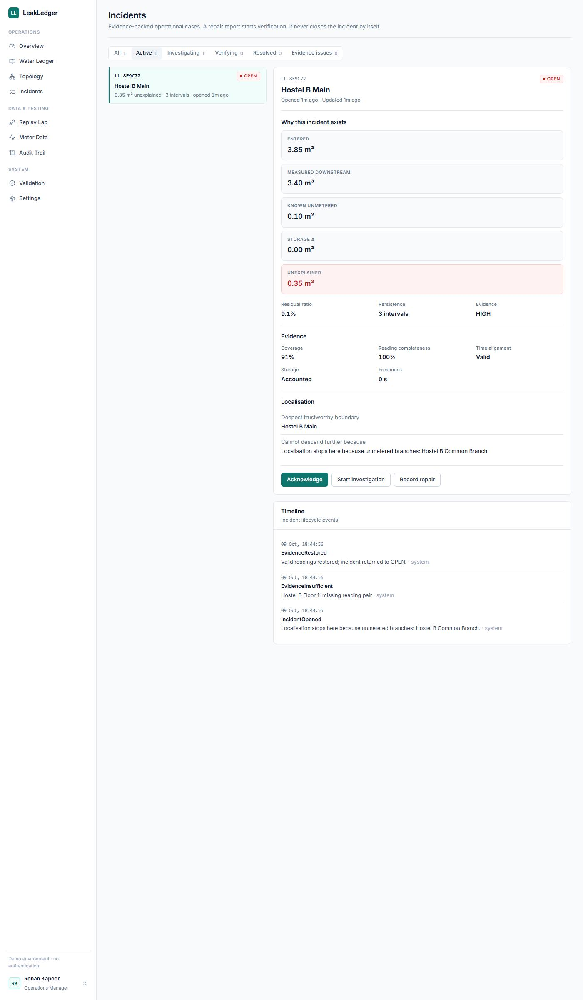

#### Replay Lab (`/replay`)

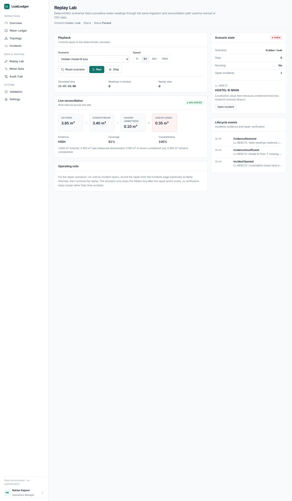

#### Meter Data (`/meters`)

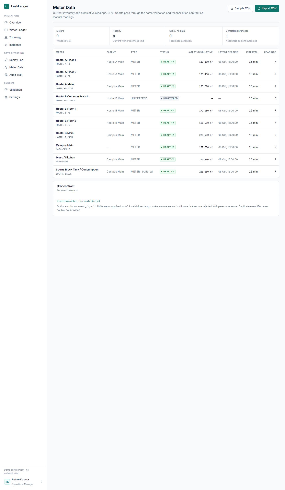

#### Audit Trail (`/audit`)


#### Settings (`/settings`)


#### Validation (`/validation`)

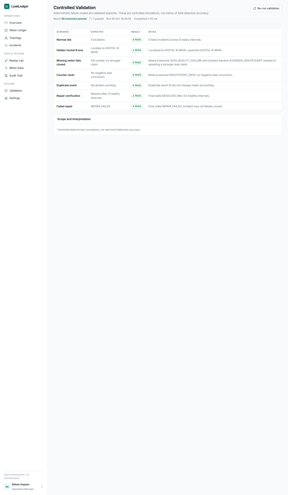

</details>

## Repository layout

```text
backend/
  app/
    aws/               S3, EventBridge, CloudWatch and AWS runtime adapters
    domain/            deterministic domain models
    repositories/      in-memory + DynamoDB persistence adapters
    services/          reconciliation, topology and incident logic
    simulator/         deterministic replay generator and scenarios
    main.py            FastAPI HTTP API
    worker.py          SQS batch reconciliation worker
  tests/               unit, API, AWS-contract and runtime integration tests
frontend/              Next.js 15 + TypeScript + Tailwind UI
infrastructure/        AWS CDK stack
sample-data/           CSV examples
scripts/               local start and deployment-artifact scripts
docs/                  architecture, algorithms, demo script and ADRs
```

## Local development

### Backend

Python 3.12+ recommended.

```bash
cd backend
python -m venv .venv
source .venv/bin/activate      # Windows: .venv\Scripts\activate
pip install -r requirements.txt
uvicorn app.main:app --reload --port 8000
```

FastAPI docs: `http://localhost:8000/docs`

### Frontend

```bash
cd frontend
npm install
npm run dev
```

Open `http://localhost:3000`.

`NEXT_PUBLIC_API_URL` defaults to `http://localhost:8000`.

Windows helper scripts are included in `scripts/`.

## Local mode and AWS mode

LeakLedger has one domain engine and two runtime adapters.

### Local mode

Default `LEAKLEDGER_MODE=local`:

```text
Next.js -> FastAPI -> LocalStore -> ReconciliationEngine -> IncidentService
```

This mode requires no AWS credentials and is ideal for development and demo rehearsal.

### AWS mode

Set by the CDK-deployed Lambda environment:

```text
HTTP API
  -> API Lambda
      -> S3 raw archive
      -> EventBridge MeterReadingReceived
          -> SQS + DLQ
              -> reconciliation worker Lambda
                  -> DynamoDB state
                  -> domain events on EventBridge
                  -> CloudWatch custom metrics
```

Both modes use the same reconciliation and incident services. The cloud path is not a separate fake demo implementation.

## AWS implementation included in source

`infrastructure/` defines:

- Amazon API Gateway HTTP API
- Python 3.12 API Lambda
- Python 3.12 reconciliation worker Lambda
- Amazon S3 immutable raw-meter-event archive
- Amazon EventBridge custom event bus
- Amazon SQS reconciliation queue
- SQS dead-letter queue
- Amazon DynamoDB state table with point-in-time recovery
- CloudWatch custom-metric dashboard
- CloudWatch DLQ alarm
- X-Ray tracing on both Lambdas
- private S3 frontend bucket
- CloudFront distribution
- static Next.js export deployment

The backend AWS adapters implement:

- conditional DynamoDB idempotency claims
- persistent nodes, readings, balances, incidents, settings, audit events and demo state
- raw S3 event archiving
- EventBridge meter/domain events
- CloudWatch metrics
- partial-batch SQS failure reporting
- grouping sibling meter events by site + physical interval before reconciliation

## Idempotency and interval correctness

Two different protections exist because they solve different failure modes:

1. **Event idempotency** — duplicate `event_id`s are conditionally claimed in DynamoDB and cannot be processed twice.
2. **Interval idempotency** — persistence and repair-verification streaks can advance only once per distinct reconciliation interval, even if sibling meter readings arrive in separate/retried messages.

This prevents transport ordering from manufacturing false “three consecutive intervals” evidence.

## Deterministic replay scenarios

Replay Lab supports:

1. **Normal** — all water balances; zero incidents.
2. **Hidden Hostel B loss** — 0.35 m³/interval disappears below Hostel B Main.
3. **Missing meter** — an incident is established, then a downstream meter disappears; evidence becomes insufficient instead of overclaiming.
4. **Counter reset** — cumulative counter continuity fails without producing negative-flow leak arithmetic.
5. **Successful repair** — loss stops only after a repair action exists; three distinct healthy intervals verify the repair.
6. **Failed repair** — reported repair reduces but does not remove the loss; the incident becomes `REPAIR_FAILED`.

The replay generator emits ordinary cumulative meter readings through the same ingestion/domain path as manual or CSV data.

## Controlled validation screen

`/validation` executes deterministic controlled scenarios and exposes PASS/FAIL results for:

- normal site produces zero false incidents
- hidden loss localises to Hostel B
- missing reading fails closed
- duplicate event does not double count
- successful repair requires verification
- failed repair remains unresolved

These are software-behaviour tests, **not field-detection-accuracy claims**.

## Meter ingestion

Supported MVP inputs:

- manual HTTP reading
- HTTP batch reading
- CSV upload
- deterministic simulator
- AWS event-driven ingestion

CSV requires:

```text
timestamp,meter_id,cumulative_m3
```

Optional columns:

```text
event_id,unit
```

Units accepted by the API include cubic metres (`m3`) and litres (`L`), normalized internally to m³.

## Core API

```text
GET  /health
GET  /sites
GET  /sites/{siteId}
GET  /sites/{siteId}/overview
GET  /sites/{siteId}/topology
PUT  /sites/{siteId}/topology/{nodeId}
GET  /sites/{siteId}/ledger
GET  /sites/{siteId}/meters
GET  /sites/{siteId}/readings
POST /sites/{siteId}/readings
POST /sites/{siteId}/readings/batch
GET  /sites/{siteId}/import/sample
POST /sites/{siteId}/import
GET  /sites/{siteId}/settings
PUT  /sites/{siteId}/settings
GET  /sites/{siteId}/incidents
GET  /incidents/{incidentId}
POST /incidents/{incidentId}/acknowledge
POST /incidents/{incidentId}/investigate
POST /incidents/{incidentId}/repair
GET  /incidents/{incidentId}/events
GET  /sites/{siteId}/audit
POST /demo/reset
POST /demo/replay
POST /demo/step
POST /demo/pause
POST /demo/resume
GET  /demo/state
GET  /demo/validation
```

## Fail-closed rules

Leak classification is suspended when an important prerequisite is not trustworthy, including:

- required meter observation missing
- stale meter feed
- timestamp skew outside tolerance
- child-accounted flow contradicts parent inflow
- cumulative meter counter reset
- downstream coverage below configured minimum
- unsupported/inconsistent unit
- unmodelled storage/buffer behavior

Evidence quality is transparent. The UI exposes:

- topology coverage
- reading completeness
- freshness/availability
- time alignment
- storage treatment
- arithmetic explanation

There is no opaque “AI confidence” number.

## Current deterministic defaults

| Rule | Default |
|---|---:|
| Reconciliation interval | 15 minutes |
| Minimum unexplained residual | 0.05 m³ |
| Minimum residual ratio | 8% |
| Persistence before incident | 3 distinct valid intervals |
| Minimum downstream coverage | 85% |
| Timestamp tolerance | 120 seconds |
| Healthy intervals required to verify repair | 3 distinct intervals |

These values are editable from the Settings screen and persisted by the selected runtime.

## Meter topology and storage

The seeded fictional campus includes:

- Campus Main
- Hostel A Main + floor meters
- Hostel B Main + floor meters
- explicitly unmetered Hostel B common branch
- Mess Main
- Sports Block configured as a buffered/storage example

A buffered/storage boundary is not treated like a simple pipe. Storage change can be configured explicitly; otherwise the UI exposes the reduced certainty rather than silently converting storage movement into “leakage.”

## Incident state machine

Core states:

```text
OPEN
 -> ACKNOWLEDGED
 -> INVESTIGATING
 -> VERIFYING
 -> RESOLVED
             \
              -> REPAIR_FAILED

Any active case may surface EVIDENCE_INSUFFICIENT when observability is lost.
```

State transitions are domain-controlled rather than arbitrary frontend status edits.

## Repair verification

A repair report records:

- actor
- repair type
- location
- notes
- optional physical cause
- optional cost

Then the incident enters `VERIFYING`.

Resolution requires the configured number of **distinct valid balanced intervals**. If unexplained loss remains above the threshold across the verification sequence, the system marks the repair `REPAIR_FAILED`.

## Audit trail

Every important action is represented in the audit trail, including:

- `MeterReadingReceived`
- `ReconciliationCompleted`
- evidence/data-quality changes
- incident creation and transitions
- repair report
- verification progress
- repair verified / failed

The UI allows expanding an audit row to inspect the event payload and correlation ID.

## Observability

The AWS runtime emits structured logs and custom metrics in namespace `LeakLedger`, including:

- `ReadingsProcessed`
- `ReconciliationsCompleted`
- `BalanceViolations`
- `DataQualityFailures`
- `IncidentsOpened`
- `RepairsVerified`
- `RepairsFailed`
- `DuplicateEventsIgnored`
- `ProcessingLatency`

The CDK dashboard also includes SQS queue health and Lambda errors.

## Automated tests

From the repository root:

```bash
make test
```

At packaging time, the backend suite contains **22 passing tests** covering the domain, API and AWS-runtime contracts, including:

- normal/balanced operation
- hidden-loss localisation
- post-incident missing-reading fail-closed behavior
- counter reset handling
- duplicate-event idempotency
- m³/litre normalization
- unsupported-unit rejection
- children-greater-than-parent data-quality failure
- stale/incomplete evidence handling
- settings persistence/update behavior
- topology accounting configuration
- controlled validation endpoint
- successful repair verification
- failed repair rejection
- same physical interval cannot advance persistence twice
- same interval cannot advance repair verification twice
- S3 archive contract
- EventBridge publishing contract
- CloudWatch metric contract
- SQS grouping/parsing behavior
- in-memory AWS-runtime batch integration: loss -> incident -> repair -> verified resolution

See `VALIDATION.md` for the exact checks performed in the packaging environment.

## Build deployment artifacts

Before deploying:

```bash
make test
make build-artifacts
```

`make build-artifacts`:

1. packages backend dependencies and application code into `dist/lambda`
2. performs a static Next.js build/export into `dist/frontend`

Then:

```bash
cd infrastructure
npm install
npm run build
npm run synth
# first CDK deployment in an account/region only:
# npx cdk bootstrap
npm run deploy
```

### Frontend edge modes

`infrastructure/cdk.json` controls how the static export is served:

- `"leakledger:cloudfront": "true"` (default) — private S3 + CloudFront distribution with the `/api/*` rewrite, as designed above.
- `"leakledger:cloudfront": "false"` — the same static export is bundled into the API Lambda and served through API Gateway on one public HTTPS URL. This is used when the AWS account is still pending CloudFront verification and cannot create distributions. API paths work both with and without the `/api` prefix.

Flip the flag (or remove it to use the default) and redeploy once the account can create CloudFront resources.

No AWS account IDs, credentials or application secrets are committed.

## Environment variables

Local frontend:

```text
NEXT_PUBLIC_API_URL=http://localhost:8000
```

AWS Lambda values are injected by CDK:

```text
LEAKLEDGER_MODE=aws
STATE_TABLE=<DynamoDB table>
RAW_BUCKET=<S3 raw event bucket>
EVENT_BUS=<EventBridge bus>
```

## Important limitations

LeakLedger deliberately does not claim more than the available instrumentation can prove.

- It cannot localise below available meter coverage.
- A configured unmetered branch is accounted for only to the known/configured amount.
- Tank/storage behavior must be measured/configured or reconciled over suitable windows.
- It identifies the deepest trustworthy inspection boundary, not the exact physical crack in a pipe.
- It does not replace acoustic, pressure or professional physical leak inspection.
- Controlled simulation results are not real-world sensitivity/specificity measurements.
- The current production deployment runs on the API-Gateway-hosted frontend path because the deployment account is pending CloudFront verification; the CloudFront stack path remains available via `leakledger:cloudfront=true`.

## No-AI declaration

LeakLedger uses no LLM, machine-learning model, embeddings, vector database, computer vision or generative AI. Decisions are deterministic and explainable from meter arithmetic, topology, timestamps, explicit thresholds and state transitions.

## Demo close

**LeakLedger doesn't guess where water went. It reconciles it.**
